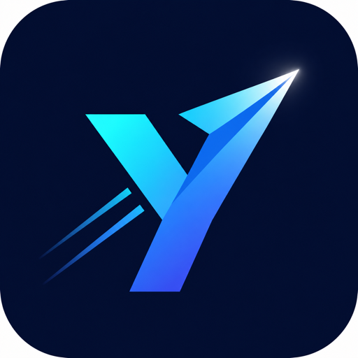
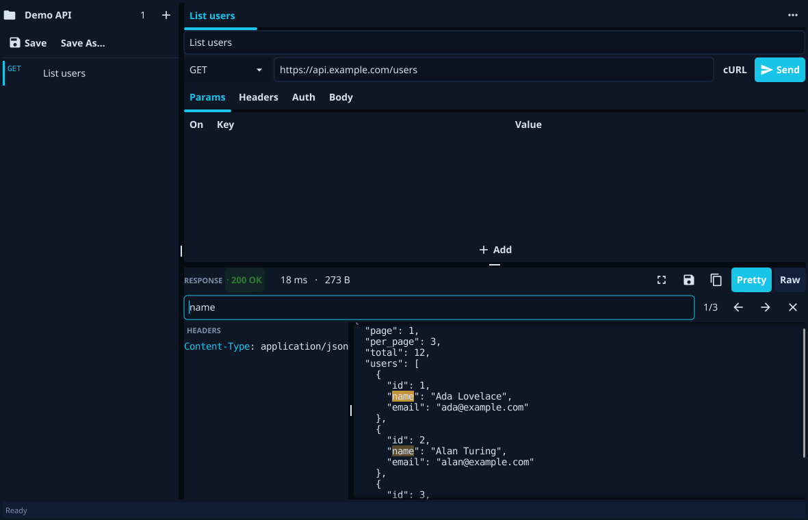

<p align="center">
  
</p>

<h1 align="center">Yon</h1>

<p align="center"><b>Throw a request. Catch a response.</b></p>

<p align="center">
A fast, lightweight, <b>open-source</b> desktop client for testing HTTP APIs.
A single native binary for macOS, Windows, and Linux — no account, no cloud,
no telemetry. Your work stays in plain files on your own disk.
</p>

<p align="center">
  
</p>

---

## Why Yon

Yon is small on purpose. It's a tiny native app that opens instantly, never asks
you to sign in, and keeps everything offline in human-readable files you can commit
to git. Free and open source under the MIT licence — read it, fork it, ship it. It
does the everyday job — fire a request, read the response — and gets out of your way.

The name is Thai: **โยน (yon)** = *to throw*. You throw a request; you catch a response.

## Features

- **Methods:** GET · POST · PUT · DELETE
- **Query parameters** and **headers** as toggleable key/value tables
- **Auth:** None · Basic · Bearer — set a default on the collection and inherit or
  override it per request
- **Body:** None · JSON (auto `Content-Type` + pretty) · Text
- **Response viewer:** status · time · size · headers, with a **Pretty** (indented,
  JSON syntax-coloured) / **Raw** toggle and one-click **Copy**; huge bodies render
  fast (virtualized) and are capped on screen with a *Save Output As…* escape hatch
- **Find in response (⌘F / Ctrl+F):** search the body with match highlighting, a
  match counter, next/previous navigation, and Esc to close
- **Pop-out window** (⤢): open a response in its own resizable window — drag-select
  and copy text, **Save Output As…** for the full body, or search with highlighting
- **Copy as cURL:** turn any request into a ready-to-run `curl` command
- **Send / Cancel** any in-flight request — or press **Enter** in the URL bar to send
- **Collections** saved as plain-JSON `.yon` files — one window per collection, one
  tab per request; native OS open/save dialogs with **Save** / **Save As**, plus
  **Open Recent**. Your open collections and tabs are restored on the next launch
- **Import Collection (JSON):** bring in requests from a Collection v2.1 JSON export —
  folders are flattened into request names and anything Yon can't represent is reported
- **Edit menu:** Copy · Paste · Find…
- **Themes:** Dark Pro / Warm / System, switchable in Settings
- **Connection settings:** request timeout, follow redirects, system proxy support,
  and an *Allow insecure TLS* toggle for self-signed dev APIs
- **Updates:** a manual *Check for Updates…* (plus an opt-in startup check, **off by
  default**) that finds a newer GitHub release and downloads the build for your OS to
  your Downloads folder — no telemetry, it only reaches the network when you ask

## Install

Download a prebuilt build from the [latest release](https://github.com/ultramcu/yon/releases/latest):

| Platform | Download |
|---|---|
| **macOS** (universal — Apple Silicon + Intel) | `Yon-*-macos-universal.zip` |
| **Windows** | `Yon-*-windows.zip` |
| **Linux** | `Yon-*-linux.tar.xz` |

> macOS is unsigned, so on first launch right-click the app → **Open** to bypass Gatekeeper.

Or run / build from source (below).

## Run / build from source

Requires **Go 1.26+** and a C toolchain (Fyne uses cgo/OpenGL).

```sh
git clone https://github.com/ultramcu/yon
cd yon
go run .
```

Build a binary:

```sh
go build -o yon .
```

Open a collection on launch by passing its `.yon` file (one window per file; this
takes precedence over restoring the previous session):

```sh
yon mycollection.yon
yon api/users.yon api/billing.yon
```

Package a native app bundle with the embedded icon (optional, needs the Fyne CLI):

```sh
go run fyne.io/tools/cmd/fyne package -os darwin   # or windows / linux
```

## The `.yon` file

A collection is one human-readable JSON file you can keep in git:

```json
{
  "version": 1,
  "name": "My API",
  "auth": { "kind": "bearer", "token": "..." },
  "requests": [
    {
      "name": "List users",
      "method": "GET",
      "url": "https://api.example.com/users",
      "params": [{ "key": "page", "value": "1", "enabled": true }],
      "auth": { "kind": "inherit" }
    }
  ]
}
```

## Architecture

The core is UI-free and fully testable; Fyne lives only in the front end.

| Package | Role |
|---|---|
| `internal/model` | data types + auth resolution (no Fyne, no net) |
| `internal/yonner` | builds and sends the HTTP request (the engine) |
| `internal/store` | reads/writes `.yon` files |
| `internal/ui` + `main.go` | the Fyne desktop UI (the only Fyne importers) |

## Roadmap (post-v1)

Environments & variables · request history · collection folders · import from
OpenAPI and `.http` files · form-data & multipart bodies · pre-request scripts.

## License

MIT
